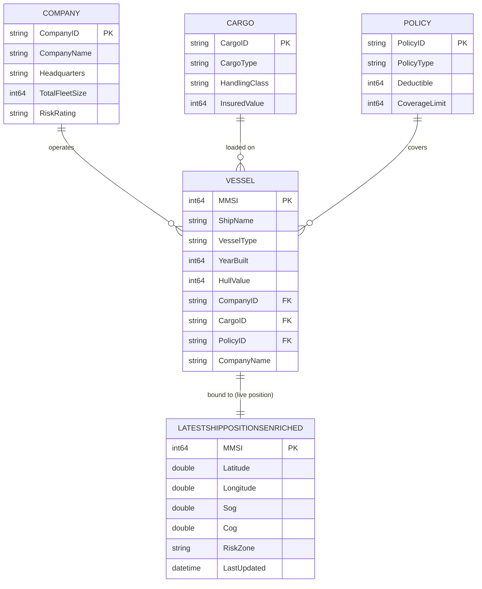

# 🚢 Maritime Risk Assessment Data Agent ("Company Brain")

This repository provides the architectural blueprint for a maritime insurance "Company Brain." By fusing real-time IoT vessel telemetry with unstructured policy documentation, this solution enables generative AI to execute dynamic, ontology-driven risk and compliance checks.

## 🏗 High-Level Architecture


The solution relies on four core layers integrated within **Microsoft Fabric**:

1. **Ontology Layer:** Defines the semantic relationship between vessels, companies, cargo, and insurance contracts.
2. **Telemetry Stream:** We leverage **[AisStream.io](https://aisstream.io/)** as our real-time global maritime data source. Live AIS telemetry is ingested via Fabric Eventstream into a KQL Database (Eventhouse).
3. **Policy Knowledge Base:** Vectorized insurance policy documentation indexed in **Azure AI Search** for RAG (Retrieval-Augmented Generation).
4. **Data Agent:** An orchestrator that dynamically computes risk by mapping live vessel coordinates (from Eventhouse) against contractual warranties (from Azure AI Search).

## 🌳 Ontology & Entity Relations

The business ontology is materialized in the **`maritimeSM`** semantic model (Direct Lake over `maritimeLH`). The **Vessel** is the central entity that ties together the operating **Company**, the carried **Cargo**, and the covering **Policy**.

### Entity Tree

```text
Vessel (hub entity)
├── operated by ──▶ Company   (CompanyID)
├── carries ──────▶ Cargo     (CargoID)
├── insured by ───▶ Policy    (PolicyID)
└── located at ───▶ LatestShipPositionsEnriched  (Eventhouse MV — live position, keyed by MMSI)
```

### Live Position Binding

The **Vessel** entity is bound to the Eventhouse **materialized view** `LatestShipPositionsEnriched`. A materialized view in KQL de-duplicates the incoming AIS stream and keeps only the **most recent record per distinct ship (MMSI)** — so at any point in time the ontology resolves each vessel to its **current, real-time location** (plus enriched attributes such as speed, heading, and the risk zone it currently occupies). This is what lets the Data Agent evaluate risk against a vessel's *live* position rather than a stale snapshot.

### Entity-Relationship Diagram



> **`LATESTSHIPPOSITIONSENRICHED`** is the Eventhouse materialized view (not a Lakehouse table). It is keyed 1:1 to `VESSEL` on `MMSI` and always exposes the single latest enriched position row per distinct ship.

### Relationships

| From (Vessel) | To Entity | Key | Cardinality | Meaning |
| ------------- | --------- | --- | ----------- | ------- |
| `vessels.CompanyID` | `companies.CompanyID` | CompanyID | Company 1 — ∗ Vessel | The company that operates the vessel |
| `vessels.CargoID` | `cargomaster.CargoID` | CargoID | Cargo 1 — ∗ Vessel | The cargo currently loaded on the vessel |
| `vessels.PolicyID` | `policies.PolicyID` | PolicyID | Policy 1 — ∗ Vessel | The insurance policy covering the vessel |

All three relationships use **bi-directional cross-filtering**, allowing the Data Agent to traverse the ontology in either direction — e.g., from a high-risk zone infraction on a live vessel back to its `RiskRating` (Company), `HandlingClass` (Cargo), and `CoverageLimit` / `Deductible` (Policy).

## 📁 Repository Structure

```text
├── fabric-assets/      # Schema definitions for Eventhouse and Eventstream
├── notebooks/          # Fabric Notebooks for initialization and simulation
│   ├── runVessels.ipynb                # Live telemetry generator streaming to Eventhouse (run first)
│   ├── runVesselswithSimulation.ipynb  # Simulated ship #1 itinerary crossing risk zones
│   ├── runVesselswithSimulation2.ipynb # Simulated ship #2 itinerary crossing risk zones
│   └── createOntology.ipynb            # Builds entity tables from Eventhouse ship data (run after)
├── resources/           # Policy documents (Source of Truth for RAG)
└── maps/               # Power BI/Real-Time Dashboard definitions

```

## 🚀 Deployment Instructions

### Quick Start

**For most users**: Clone this repository and run `deployworkspace.ipynb` to deploy all 18 Fabric items in ~3 minutes with automatic dependency management.

```bash
git clone -b fabriciq-maritimedemo https://github.com/dorirabin/fabricdemo.git
cd fabricdemo
pip install azure-identity fabric-cicd requests
code deployworkspace.ipynb  # Open in VS Code and run cells 1-9
```

After deployment, configure Azure Key Vault secrets and run the vessel notebooks to populate data.

---

This solution can be deployed in two ways:
1. **Automated Deployment** (Recommended): Deploy all Fabric items from Git in one step using `deployworkspace.ipynb`
2. **Manual Deployment**: Create items individually in the Fabric portal

### Automated Deployment from Git (Recommended)

This repository includes an automated deployment notebook that deploys all 18 Fabric items with proper dependency management in a single execution.

#### Prerequisites

1. **Python Environment**:
   ```bash
   pip install azure-identity fabric-cicd requests
   ```

2. **Git Clone**:
   ```bash
   git clone -b fabriciq-maritimedemo https://github.com/dorirabin/fabricdemo.git
   cd fabricdemo
   ```

3. **Microsoft Fabric Workspace**: Create an empty Fabric workspace or use an existing one

#### Deployment Steps

1. **Open the deployment notebook** in VS Code or Jupyter:
   ```bash
   code deployworkspace.ipynb
   ```

2. **Authenticate**: Run cells 1-5 to authenticate with Azure and select your target workspace
   - The notebook uses `DeviceCodeCredential` for browser-based authentication
   - You'll be prompted to select your target workspace from the list

3. **Deploy all items**: Run cell 9 to execute the complete 6-phase deployment:
   - **Phase 1**: Lakehouse + Eventhouse (data foundation)
     - Automatically uploads GeoJSON files to Lakehouse Files
   - **Phase 2**: SemanticModel + Power BI Report
     - Automatically updates DirectLake connection to new Lakehouse
   - **Phase 3**: Ontology
     - Automatically links to deployed Power BI report
   - **Phase 4**: Notebooks + Eventstream + Data Agent
   - **Phase 5**: Reflex (alert/activator)
   - **Phase 6**: Map (depends on Ontology)

4. **Verify deployment**: The notebook automatically verifies all 18 items are deployed correctly

5. **Next steps**: After deployment completes, proceed to [Initialize Ontology Tables](#initialize-ontology-tables) below

#### What Gets Deployed

The automated deployment creates:
- **1 Lakehouse** (`maritimeLH`) with 2 GeoJSON files
- **1 Eventhouse** (`maritimeEH`) with KQL Database
- **1 SemanticModel** (`maritimeSM`) with DirectLake connection
- **1 Power BI Report** (`Vessels By Company`)
- **1 Ontology** (`maritimeOntologyfromSM`) linked to the report
- **4 Notebooks** (createOntology, runVessels, runVesselswithSimulation, runVesselswithSimulation2)
- **1 Eventstream** (`maritimeES`)
- **1 Data Agent** (`maritimeDA`)
- **1 Reflex** (`RedAlertActivator`)
- **1 Map** (`vessels_map`)

> 💡 **Important**: The deployment notebook handles all dependencies automatically - workspace references, lakehouse IDs, and resource links are dynamically updated during deployment.

---

## Initialize Ontology Tables

After automated deployment completes, you must initialize the lakehouse tables before the Power BI report will work.

### Step 1: Run createOntology Notebook

1. **Open Fabric portal** → Navigate to your deployed workspace
2. **Open the `createOntology` notebook**
3. **Run all cells** to create the lakehouse tables:
   - `companies` - Company master data
   - `vessels` - Vessel fleet information  
   - `cargo` - Cargo types and handling classes
   - `policies` - Insurance policy details
   - `maritimezones` - Geographic risk zones

### Step 2: Refresh the SemanticModel

After the tables are created, refresh the SemanticModel to register the metadata:

1. **In Fabric portal**, navigate to the `maritimeSM` SemanticModel
2. **Click "Refresh now"** in the toolbar
3. **Wait for refresh to complete** (~30 seconds)
   - This validates the schema and registers lakehouse metadata
   - DirectLake models require this initial metadata refresh

### Step 3: Verify the Report

1. **Open the `Vessels By Company` report**
2. **Verify data appears** in all visuals
3. If you see errors like "table is not refreshed", repeat Step 2

> ✅ **Once complete**, the report will work and the ontology will be ready for the Data Agent!

---

## Post-Deployment Configuration

After deploying the Fabric items and initializing the ontology, you need to configure **3 parameters** in the vessel notebooks before running them.

### Configure Vessel Notebooks (runVessels*)

The three `runVessels` notebooks require 3 parameters that must be configured before running:

#### 📋 Required Parameters

| Parameter | Description | How to obtain |
| --------- | ----------- | ------------- |
| **`AISSTREAM_API_KEY`** | API key for AisStream.io real-time AIS data | See [Step 1](#step-1-get-aisstream-api-key) below |
| **`FABRIC_ENTITY_NAME`** | Event Hub name from Eventstream endpoint | See [Step 2](#step-2-get-eventstream-connection-details) below |
| **`FABRIC_CONNECTION_STR`** | Event Hub connection string from Eventstream | See [Step 2](#step-2-get-eventstream-connection-details) below |

#### Step 1: Get AisStream API Key

1. **Create a free account** at [AisStream.io](https://aisstream.io/)
2. **Navigate to your dashboard** after logging in
3. **Generate an API key** (usually under "API Keys" or "Account Settings")
4. **Copy the generated key** - you'll use this for `AISSTREAM_API_KEY`

> 📖 **Authentication docs**: <https://aisstream.io/documentation#Authentication>

#### Step 2: Get Eventstream Connection Details

After deploying the Eventstream, retrieve the Event Hub name and connection string:

1. **Open Fabric portal**: https://app.fabric.microsoft.com
2. **Navigate to your deployed workspace**
3. **Open the `maritimeES` Eventstream**
4. **Click on `LiveAISSource`** (Custom Endpoint in the diagram)
5. **Go to `SAS Key Authentication` tab → `Live view`**
6. **Copy both values**:
   - **Event Hub name** (e.g., `esehchxkj881x95xl1hgnk_eh`) → use for `FABRIC_ENTITY_NAME`
   - **Connection string** (starts with `Endpoint=sb://...`) → use for `FABRIC_CONNECTION_STR`

> ⚠️ **Why manual?** These values are unique per deployment and cannot be predicted or retrieved via API.

#### Step 3: Update Notebook Configuration Cells

Open each of the 3 notebooks and update their **first configuration cell**:

**Files to update:**
- `runVessels.Notebook/notebook-content.py`
- `runVesselswithSimulation.Notebook/notebook-content.py`
- `runVesselswithSimulation2.Notebook/notebook-content.py`

**Configuration cell (first code cell in each notebook):**

```python
# ===== CONFIGURATION =====

# 1. AisStream.io API Key
AISSTREAM_API_KEY = "your-key-from-aisstream-dashboard"  # ← UPDATE THIS

# 2. Eventstream Event Hub Name (from Step 2 above)
FABRIC_ENTITY_NAME = "esehchxkj881x95xl1hgnk_eh"  # ← UPDATE THIS

# 3. Eventstream Connection String (from Step 2 above)
# Option A (Production): Use Azure Key Vault
KEY_VAULT_NAME = "https://kv-maritime-demo.vault.azure.net/"  # ← UPDATE THIS
FABRIC_CONNECTION_STR = mssparkutils.credentials.getSecret(KEY_VAULT_NAME, "FabricConnectionString")

# Option B (Local Testing): Use direct value (NEVER commit to Git!)
# FABRIC_CONNECTION_STR = "Endpoint=sb://xxxxx.servicebus.windows.net/;SharedAccessKeyName=...;SharedAccessKey=...;EntityPath=esehchxkj881x95xl1hgnk_eh"  # ← UPDATE THIS
```

> 💡 **Best Practice**:  
> - **Production**: Store `FABRIC_CONNECTION_STR` in Azure Key Vault (Option A)  
> - **Local Testing**: Use direct values (Option B) but **never commit to source control**

#### Step 4: Run the Notebooks

After configuring all 3 parameters, run the notebooks to populate the Eventhouse:

* **`runVessels.ipynb`**: Creates **real data points** from the live AIS stream — run this to generate and stream real-time telemetry from **[AisStream.io](https://aisstream.io/)** into your Eventhouse.
* **`runVesselswithSimulation.ipynb`** and **`runVesselswithSimulation2.ipynb`**: Create **two simulated ship itineraries** that deliberately cross the defined risk zones, also streaming into the Eventhouse.

Together these populate the Eventhouse tables (including the `LatestShipPositionsEnriched` materialized view) with the distinct ships — real and simulated — that the ontology is built from.

---

### Initialize the Ontology

Run the `createOntology` notebook (already deployed in your workspace). It reads the ship data landed in the Eventhouse (Step 2) to populate the **base master/entity tables inside the Lakehouse** (Vessels, Companies, Cargo, Policies). These base tables are the foundation for the rest of the solution:

* **Semantic model** — the `maritimeSM` Direct Lake semantic model is built on top of these Lakehouse tables.
* **Report** — the Power BI report (`Vessels By Company`) is built on top of that semantic model.
* **Ontology (first version)** — the **first version of the ontology component** is generated **manually from the semantic model** (using the *Create ontology* button inside `maritimeSM`), not by the notebook. This initial ontology captures the static business entities and relationships **before** the real-time position data from the Eventhouse (the `LatestShipPositionsEnriched` materialized view) is bound to the `Vessel` entity.

**Run this only after Step 2 has populated the Eventhouse**, otherwise the base tables — and everything built on them — will be empty.

### 4. Vectorize & Index Policies

> ⚠️ **Build the Azure AI Search index before you start asking the Data Agent questions** — the agent needs the policy index in place to answer contractual/warranty questions once the simulated ships are crossing the risk zones.

To enable the Data Agent to understand contractual warranties:

1. **Manage Policies:** The policy documents are version-controlled in the `/resources` folder of this repository.
2. **Upload to Lakehouse:** Upload these files from your local clone to your Lakehouse `Files/` directory so they are accessible to the Azure AI Search indexer.
3. **Index:** Configure an Azure AI Search indexer to vectorize these documents (e.g., using `text-embedding-3-large`).

### 5. Explore & Visualize Risks

Open the visual map and ask the **Data Agent** questions about policy coverage, total risk assessment, etc. As each ship enters or exits a risk zone, you will see the agent return **different, context-aware responses** — elevated risk and warranty-breach warnings while inside a risk zone, versus standard coverage responses when outside. Connect your Power BI reports/dashboards to the Eventhouse KQL endpoint to visualize live ship movements, high-risk zone infractions, and policy warranty breaches.

## 🤖 Building the Data Agent

The **Maritime Data Agent** ("Company Brain") is the orchestration layer that fuses live telemetry, the business ontology, and unstructured policy text into a single natural-language interface. It is defined in **`maritimeDA.DataAgent`**.

### Data Sources

The agent is grounded on **three** complementary sources — each answering a different part of a risk question:

| # | Source | Type | Role in the Agent |
| - | ------ | ---- | ----------------- |
| 1 | **`LatestShipPositionsEnriched`** | Eventhouse materialized view (KQL) | The *live position* source — supplies each ship's current location, speed, heading, and the risk zone it currently occupies (latest row per distinct `MMSI`). |
| 2 | **`maritimeSM` ontology** | Direct Lake semantic model | The *business context* — resolves a vessel to its operating **Company**, carried **Cargo**, and covering **Policy** (with `RiskRating`, `HullValue`, `CoverageLimit`, `Deductible`, etc.). |
| 3 | **Azure AI Search policy index** | Vector index (RAG) | The *contractual truth* — retrieves the exact warranty / exclusion clauses from the vectorized policy documents in `/resources`. |

At query time the agent maps a vessel's live coordinates (source 1) onto its contractual context (source 2), then retrieves and cites the relevant policy clauses (source 3) to produce a grounded risk & compliance answer.

### Agent Instructions (System Prompt)

The agent is configured with instructions along these lines:

```text
You are the Maritime Risk Assessment "Company Brain."
Answer questions about vessels, their operators, cargo, insurance policies, and
real-time risk exposure.

Grounding rules:
- Always resolve a ship's CURRENT location from LatestShipPositionsEnriched
  (the Eventhouse materialized view — one latest row per MMSI). Never use stale rows.
- Use the ontology (Vessel → Company / Cargo / Policy) to enrich the ship with its
  business and contractual context.
- For any policy, warranty, coverage-limit, deductible, or exclusion question,
  retrieve and CITE the relevant clause from the Azure AI Search policy index.
- A vessel is "in a risk zone" only when its latest RiskZone value is a named zone
  (not null/none). Base risk statements on that live value.

Behavior:
- If a ship is inside a risk zone, flag elevated risk and call out any breached
  warranties, plus the financial exposure (HullValue, CoverageLimit, Deductible).
- If a ship is outside all risk zones, report standard coverage with no active breach.
- Always state whether your answer is based on live position, ontology, or policy text.
- Be concise, quantify exposure where possible, and never invent policy terms.
```

### Few-Shot Prompts

These example prompts demonstrate the different, context-aware answers the agent returns depending on whether a ship is inside or outside a risk zone:

| Prompt | Expected behavior |
| ------ | ----------------- |
| *"Where is vessel <ShipName> right now and is it in a risk zone?"* | Reads latest row from `LatestShipPositionsEnriched`; reports live lat/long + current `RiskZone`. |
| *"What is the total risk assessment for <ShipName>?"* | Joins live position → ontology (Company `RiskRating`, `HullValue`) → policy `CoverageLimit`/`Deductible`; summarizes total exposure. |
| *"Is <ShipName> in breach of any policy warranty?"* | If inside a risk zone, retrieves the matching warranty/exclusion clause from AI Search and flags the breach; if outside, reports no active breach. |
| *"Which of my ships are currently inside a high-risk zone?"* | Filters `LatestShipPositionsEnriched` where `RiskZone` is a named zone; lists the affected vessels and their operators. |
| *"What does the policy say about war-risk zones for <ShipName>?"* | Pure RAG call to the Azure AI Search policy index; quotes and cites the relevant clause. |

> 💡 Try the same prompt twice — once while a simulated ship is **inside** a risk zone and once while it is **outside** — to see the agent's grounded response change in real time.

## 🛠 Prerequisites

* A **Microsoft Fabric** capacity (Trial or Premium).
* **Azure Key Vault** (recommended for production; optional for local testing - see [Configure Security](#1-configure-security-and-api-keys)).
* **Azure AI Search** for policy vectorization.
* An **[AisStream.io](https://aisstream.io/)** account with a generated **API key** — see [🔑 Secret Keys](#-secret-keys) and the [Authentication docs](https://aisstream.io/documentation#Authentication).

## 👨‍💻 Author

**Dori Rabin** Cloud Solution Architect

