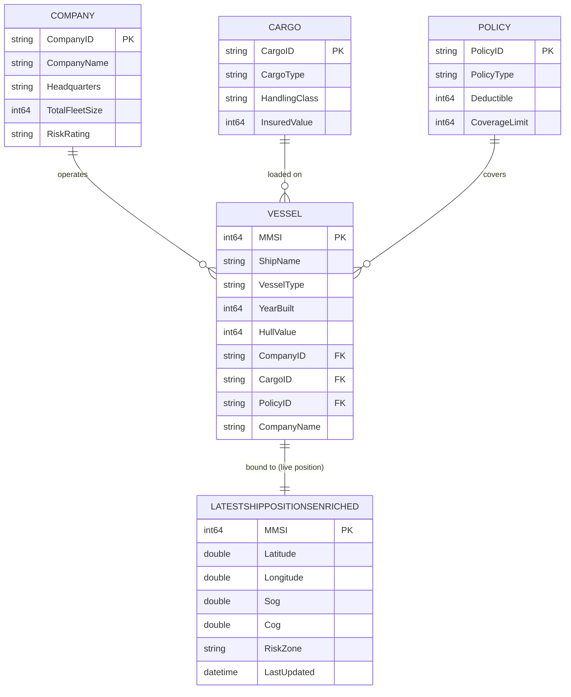

# 🚢 Maritime Risk Assessment Data Agent ("Company Brain")

This repository provides the architectural blueprint for a maritime insurance "Company Brain." By fusing real-time IoT vessel telemetry with unstructured policy documentation, this solution enables generative AI to execute dynamic, ontology-driven risk and compliance checks.

## 🏗 High-Level Architecture


The solution relies on four core layers integrated within **Microsoft Fabric**:

1. **Ontology Layer:** Defines the semantic relationship between vessels, companies, cargo, and insurance contracts.
2. **Telemetry Stream:** We leverage **[AisStream.io](https://aisstream.io/)** as our real-time global maritime data source. Live AIS telemetry is ingested via Fabric Eventstream into a KQL Database (Eventhouse).
3. **Policy Knowledge Base:** Vectorized insurance policy documentation indexed in **Azure AI Search** for RAG (Retrieval-Augmented Generation).
4. **Data Agent:** An orchestrator that dynamically computes risk by mapping live vessel coordinates (from Eventhouse) against contractual warranties (from Azure AI Search).

## 🌳 Ontology & Entity Relations

The business ontology is materialized in the **`maritimeSM`** semantic model (Direct Lake over `maritimeLH`). The **Vessel** is the central entity that ties together the operating **Company**, the carried **Cargo**, and the covering **Policy**.

### Entity Tree

```text
Vessel (hub entity)
├── operated by ──▶ Company   (CompanyID)
├── carries ──────▶ Cargo     (CargoID)
├── insured by ───▶ Policy    (PolicyID)
└── located at ───▶ LatestShipPositionsEnriched  (Eventhouse MV — live position, keyed by MMSI)
```

### Live Position Binding

The **Vessel** entity is bound to the Eventhouse **materialized view** `LatestShipPositionsEnriched`. A materialized view in KQL de-duplicates the incoming AIS stream and keeps only the **most recent record per distinct ship (MMSI)** — so at any point in time the ontology resolves each vessel to its **current, real-time location** (plus enriched attributes such as speed, heading, and the risk zone it currently occupies). This is what lets the Data Agent evaluate risk against a vessel's *live* position rather than a stale snapshot.

### Entity-Relationship Diagram



> **`LATESTSHIPPOSITIONSENRICHED`** is the Eventhouse materialized view (not a Lakehouse table). It is keyed 1:1 to `VESSEL` on `MMSI` and always exposes the single latest enriched position row per distinct ship.

### Relationships

| From (Vessel) | To Entity | Key | Cardinality | Meaning |
| ------------- | --------- | --- | ----------- | ------- |
| `vessels.CompanyID` | `companies.CompanyID` | CompanyID | Company 1 — ∗ Vessel | The company that operates the vessel |
| `vessels.CargoID` | `cargomaster.CargoID` | CargoID | Cargo 1 — ∗ Vessel | The cargo currently loaded on the vessel |
| `vessels.PolicyID` | `policies.PolicyID` | PolicyID | Policy 1 — ∗ Vessel | The insurance policy covering the vessel |

All three relationships use **bi-directional cross-filtering**, allowing the Data Agent to traverse the ontology in either direction — e.g., from a high-risk zone infraction on a live vessel back to its `RiskRating` (Company), `HandlingClass` (Cargo), and `CoverageLimit` / `Deductible` (Policy).

## 📁 Repository Structure

```text
├── fabric-assets/      # Schema definitions for Eventhouse and Eventstream
├── notebooks/          # Fabric Notebooks for initialization and simulation
│   ├── runVessels.ipynb                # Live telemetry generator streaming to Eventhouse (run first)
│   ├── runVesselswithSimulation.ipynb  # Simulated ship #1 itinerary crossing risk zones
│   ├── runVesselswithSimulation2.ipynb # Simulated ship #2 itinerary crossing risk zones
│   └── createOntology.ipynb            # Builds entity tables from Eventhouse ship data (run after)
├── resources/           # Policy documents (Source of Truth for RAG)
└── maps/               # Power BI/Real-Time Dashboard definitions

```

## 🚀 Deployment Instructions

### Quick Start

**For most users**: Clone this repository and run `deployworkspace.ipynb` to deploy all 18 Fabric items in ~3 minutes with automatic dependency management.

```bash
git clone -b fabriciq-maritimedemo https://github.com/dorirabin/fabricdemo.git
cd fabricdemo
pip install azure-identity fabric-cicd requests
code deployworkspace.ipynb  # Open in VS Code and run cells 1-9
```

After deployment, follow the post-deployment configuration steps to initialize the ontology and configure the vessel notebooks.

---

### Deployment from Git

This repository includes an automated deployment notebook that deploys all 18 Fabric items with proper dependency management in a single execution.

#### Prerequisites

1. **Python Environment**:
   ```bash
   pip install azure-identity fabric-cicd requests
   ```

2. **Git Clone**:
   ```bash
   git clone -b fabriciq-maritimedemo https://github.com/dorirabin/fabricdemo.git
   cd fabricdemo
   ```

3. **Microsoft Fabric Workspace**: Create an empty Fabric workspace or use an existing one

#### Deployment Steps

1. **Open the deployment notebook** in VS Code or Jupyter:
   ```bash
   code deployworkspace.ipynb
   ```

2. **Authenticate**: Run cells 1-5 to authenticate with Azure and select your target workspace
   - The notebook uses `DeviceCodeCredential` for browser-based authentication
   - You'll be prompted to select your target workspace from the list

3. **Deploy all items**: Run cell 9 to execute the complete 6-phase deployment:
   - **Phase 1**: Lakehouse + Eventhouse (data foundation)
     - Automatically uploads GeoJSON files to Lakehouse Files
   - **Phase 2**: SemanticModel + Power BI Report
     - Automatically updates DirectLake connection to new Lakehouse
   - **Phase 3**: Ontology
     - Automatically links to deployed Power BI report
   - **Phase 4**: Notebooks + Eventstream + Data Agent
   - **Phase 5**: Reflex (alert/activator)
   - **Phase 6**: Map (depends on Ontology)

4. **Verify deployment**: The notebook automatically verifies all 18 items are deployed correctly

5. **Next steps**: After deployment completes, proceed to [Initialize Ontology Tables](#initialize-ontology-tables) below

#### What Gets Deployed

The automated deployment creates:
- **1 Lakehouse** (`maritimeLH`) with 2 GeoJSON files
- **1 Eventhouse** (`maritimeEH`) with KQL Database
- **1 SemanticModel** (`maritimeSM`) with DirectLake connection
- **1 Power BI Report** (`Vessels By Company`)
- **1 Ontology** (`maritimeOntologyfromSM`) linked to the report
- **4 Notebooks** (createOntology, runVessels, runVesselswithSimulation, runVesselswithSimulation2)
- **1 Eventstream** (`maritimeES`)
- **1 Data Agent** (`maritimeDA`)
- **1 Reflex** (`RedAlertActivator`)
- **1 Map** (`vessels_map`)

> 💡 **Important**: The deployment notebook handles all dependencies automatically - workspace references, lakehouse IDs, and resource links are dynamically updated during deployment.

---

## Post-Deployment Configuration

After deploying the Fabric items, follow these steps to populate data and initialize the ontology:

### 1. Configure Vessel Notebooks

The three `runVessels` notebooks require 3 parameters that must be configured before running:

#### 📋 Required Parameters

| Parameter | Description | How to obtain |
| --------- | ----------- | ------------- |
| **`AISSTREAM_API_KEY`** | API key for AisStream.io real-time AIS data | See [Get AisStream API Key](#get-aisstream-api-key) below |
| **`FABRIC_ENTITY_NAME`** | Event Hub name from Eventstream endpoint | See [Get Eventstream Connection Details](#get-eventstream-connection-details) below |
| **`FABRIC_CONNECTION_STR`** | Event Hub connection string from Eventstream | See [Get Eventstream Connection Details](#get-eventstream-connection-details) below |

#### Get AisStream API Key

1. **Create a free account** at [AisStream.io](https://aisstream.io/)
2. **Navigate to your dashboard** after logging in
3. **Generate an API key** (usually under "API Keys" or "Account Settings")
4. **Copy the generated key** - you'll use this for `AISSTREAM_API_KEY`

> 📖 **Authentication docs**: <https://aisstream.io/documentation#Authentication>

#### Get Eventstream Connection Details

After deploying the Eventstream, retrieve the Event Hub name and connection string:

1. **Open Fabric portal**: https://app.fabric.microsoft.com
2. **Navigate to your deployed workspace**
3. **Open the `maritimeES` Eventstream**
4. **Click on `LiveAISSource`** (Custom Endpoint in the diagram)
5. **Go to `SAS Key Authentication` tab → `Live view`**
6. **Copy both values**:
   - **Event Hub name** (e.g., `esehchxkj881x95xl1hgnk_eh`) → use for `FABRIC_ENTITY_NAME`
   - **Connection string** (starts with `Endpoint=sb://...`) → use for `FABRIC_CONNECTION_STR`

#### Update Notebook Configuration Cells

Open each of the 3 notebooks and update their **first configuration cell**:

**Files to update:**
- `runVessels.Notebook/notebook-content.py`
- `runVesselswithSimulation.Notebook/notebook-content.py`
- `runVesselswithSimulation2.Notebook/notebook-content.py`

**Configuration cell (first code cell in each notebook):**

```python
# ===== CONFIGURATION =====

# 1. AisStream.io API Key
AISSTREAM_API_KEY = "your-key-from-aisstream-dashboard"  # ← UPDATE THIS

# 2. Eventstream Event Hub Name (from Step 2 above)
FABRIC_ENTITY_NAME = "esehchxkj881x95xl1hgnk_eh"  # ← UPDATE THIS

# 3. Eventstream Connection String (from Step 2 above)
# Option A (Production): Use Azure Key Vault
KEY_VAULT_NAME = "https://kv-maritime-demo.vault.azure.net/"  # ← UPDATE THIS
FABRIC_CONNECTION_STR = mssparkutils.credentials.getSecret(KEY_VAULT_NAME, "FabricConnectionString")

# Option B (Local Testing): Use direct value (NEVER commit to Git!)
# FABRIC_CONNECTION_STR = "Endpoint=sb://xxxxx.servicebus.windows.net/;SharedAccessKeyName=...;SharedAccessKey=...;EntityPath=esehchxkj881x95xl1hgnk_eh"  # ← UPDATE THIS
```

> 💡 **Best Practice**:  
> - **Production**: Store `FABRIC_CONNECTION_STR` in Azure Key Vault (Option A)  
> - **Local Testing**: Use direct values (Option B) but **never commit to source control**

### 2. Run Vessel Notebooks to Populate Eventhouse

After configuring all 3 parameters, run **all three notebooks** to populate the Eventhouse with ship data:

1. **`runVessels.ipynb`**: Creates **real data points** from the live AIS stream — run this to generate and stream real-time telemetry from **[AisStream.io](https://aisstream.io/)** into your Eventhouse.
2. **`runVesselswithSimulation.ipynb`**: Creates the **first simulated ship itinerary** that deliberately crosses the defined risk zones.
3. **`runVesselswithSimulation2.ipynb`**: Creates the **second simulated ship itinerary** that also crosses the defined risk zones.

Together these populate the Eventhouse tables (including the `LatestShipPositionsEnriched` materialized view) with the distinct ships — real and simulated — that the ontology is built from.

> 💡 **Tip**: You only need to run each notebook for **1-2 minutes** to populate the base Eventhouse tables and materialized views, then you can stop them. The createOntology notebook needs just enough data to build the initial entity tables.

> ⚠️ **Capacity Note**: If your Fabric capacity is limited and cannot run all three notebooks simultaneously, run them sequentially:
> 1. Start `runVessels` → run for 1-2 minutes → stop
> 2. Start `runVesselswithSimulation` → run for 1-2 minutes → stop  
> 3. Start `runVesselswithSimulation2` → run for 1-2 minutes → stop
> 
> Alternatively, increase your Fabric capacity to run multiple notebooks concurrently.

> 🗺️ **Preview Data**: After running the vessel notebooks, you can already open the **`vessels_map`** Map in Fabric portal to visualize ships crossing the risk zones in real-time! This provides immediate visual feedback before proceeding with the ontology initialization.

### 3. Initialize Ontology Tables

After the Eventhouse is populated, run the `createOntology` notebook (already deployed in your workspace). It reads the ship data from the Eventhouse to populate the **base master/entity tables inside the Lakehouse** (Vessels, Companies, Cargo, Policies). These base tables are the foundation for the rest of the solution:

1. **Open Fabric portal** → Navigate to your deployed workspace
2. **Open the `createOntology` notebook**
3. **Run all cells** to create the lakehouse tables:
   - `companies` - Company master data
   - `vessels` - Vessel fleet information  
   - `cargo` - Cargo types and handling classes
   - `policies` - Insurance policy details
   - `maritimezones` - Geographic risk zones
4. **Verify tables created**: Open the **`maritimeLH` Lakehouse** in Fabric portal and confirm all five master entity tables appear in the Tables section

**Important notes:**
* **Semantic model** — the `maritimeSM` Direct Lake semantic model is built on top of these Lakehouse tables.
* **Report** — the Power BI report (`Vessels By Company`) is built on top of that semantic model.
* **Ontology (first version)** — the **first version of the ontology component** is generated **manually from the semantic model** (using the *Create ontology* button inside `maritimeSM`), not by the notebook. This initial ontology captures the static business entities and relationships **before** the real-time position data from the Eventhouse (the `LatestShipPositionsEnriched` materialized view) is bound to the `Vessel` entity.

> ⚠️ **Run this only after the runVessels notebooks have populated the Eventhouse**, otherwise the base tables — and everything built on them — will be empty.

### 4. Refresh the SemanticModel

After the lakehouse tables are created, refresh the SemanticModel to register the metadata:

1. **In Fabric portal**, navigate to the `maritimeSM` SemanticModel
2. **Open the SemanticModel** and go into **Editing Mode**
3. **Click the "Refresh" button** and select **"Schema and data"**
4. **Wait for refresh to complete** (~30 seconds)
   - This validates the schema and registers lakehouse metadata
   - DirectLake models require this initial metadata refresh

> 💡 **Timing Note**: If you encounter an error about tables not existing or access being denied (e.g., "cannot refresh this semantic model because one or multiple source tables either do not exist or access was denied"), wait **1-2 minutes** for the lakehouse metadata to fully sync, then retry the refresh. This is normal after creating new tables.

### 5. Verify the Report

1. **Open the `Vessels By Company` report**
2. **Verify data appears** in all visuals
3. If you see errors like "table is not refreshed", repeat the SemanticModel refresh

> ✅ **Once complete**, the report will work and the ontology will be ready for the Data Agent!

### 6. Refresh the Ontology Relationship Graph

After verifying the report, you must refresh the Ontology to ensure the **Relationship Graph** is properly initialized:

1. **In Fabric portal**, navigate to the `maritimeOntologyfromSM` Ontology
2. **Select any entity** (e.g., `maritimezones`)
3. **Go to Overview → Relationship Graph** to view the entity relationships
4. **Refresh the graph** by adding a dummy property (this triggers the Ontology to rebuild its internal metadata):
   - Click **Manage property binding**
   - Click **Add properties**
   - Add a dummy property:
     - **Name**: `dummystring`
     - **Type**: `String`
   - **Save** the property
5. **Return to Relationship Graph** and verify that all entity relationships are now visible

> 💡 **Why this step?** The Ontology's Relationship Graph requires a metadata refresh after the initial deployment and semantic model refresh. Adding a property triggers this refresh, ensuring the graph is fully initialized for the Data Agent.

### 7. Configure Azure AI Search for Policy Documents

> ⚠️ **REQUIRED MANUAL CONFIGURATION**: The automated deployment **removes** any pre-existing Azure AI Search bindings to ensure a clean state. You **must** create an Azure AI Search index and manually connect it to the Data Agent before querying policies.

> ⚠️ **Build the Azure AI Search index before you start asking the Data Agent questions** — the agent needs the policy index in place to answer contractual/warranty questions once the simulated ships are crossing the risk zones.

The Data Agent uses Azure AI Search to perform RAG (Retrieval-Augmented Generation) on insurance policy documents. You must create an Azure AI Search index and manually connect it to the Data Agent.

#### Create Azure AI Search Resource

1. **Navigate to Azure Portal**: https://portal.azure.com
2. **Create a new Azure AI Search service**:
   - Resource group: Your choice
   - Service name: e.g., `maritime-policies-search`
   - Location: Same region as your Fabric capacity (recommended)
   - Pricing tier: **Basic** or higher (required for semantic search)
3. **Note the endpoint URL**: e.g., `https://maritime-policies-search.search.windows.net`
4. **Copy an API key** from **Settings → Keys** (Admin key or Query key)

> 📖 **Azure AI Search documentation**: https://learn.microsoft.com/azure/search/search-create-service-portal

#### Prepare Policy Documents

The repository includes two sample insurance policy documents in the `/resources` folder:
- `POL-9901.docx` - Sample maritime insurance policy
- `POL-9902.docx` - Sample maritime insurance policy

**Upload these to your Lakehouse** (optional, for backup) or keep them locally for indexing.

#### Create and Populate the Search Index

You have two options for creating the index:

**Option A: Using Azure Portal (Recommended for first-time users)**

1. **Open your Azure AI Search service** in Azure Portal
2. **Click "Import data"** wizard
3. **Select data source**: Upload the policy documents from `/resources`
4. **Configure index**:
   - Index name: `maritime-policies`
   - Enable **semantic search**
   - Add fields: `content` (searchable, retrievable), `metadata_storage_name` (filterable)
5. **Configure indexer**:
   - Schedule: One-time or on-demand
   - Text extraction: Enable
6. **Run the indexer** to vectorize the documents

**Option B: Using Azure SDK/REST API (For automation)**

```python
from azure.search.documents import SearchClient
from azure.search.documents.indexes import SearchIndexClient
from azure.core.credentials import AzureKeyCredential

# Create index with semantic configuration
# Upload and vectorize policy documents
# See: https://learn.microsoft.com/azure/search/search-how-to-create-search-index
```

> 📖 **Import data wizard**: https://learn.microsoft.com/azure/search/search-import-data-portal  
> 📖 **Semantic search**: https://learn.microsoft.com/azure/search/semantic-search-overview

#### Connect Azure AI Search to Data Agent

After creating and populating the index, you must **manually add it to the Data Agent** in the Fabric portal:

1. **Open Fabric portal**: https://app.fabric.microsoft.com
2. **Navigate to your deployed workspace**
3. **Open the `maritimeDA` Data Agent**
4. **Go to Settings → Data Sources**
5. **Click "Add data source" → "Azure AI Search"**
6. **Enter the configuration**:
   - **Display name**: `Maritime Policies`
   - **Endpoint**: Your Azure AI Search endpoint (from Step 1)
   - **Index name**: `maritime-policies` (or your index name from Step 3)
   - **Authentication**: API Key or Azure AD (configure accordingly)
   - **Search type**: `hybrid_semantic` (recommended)
7. **Test the connection** and **Save**

> ⚠️ **Important**: This step **cannot be automated** via API. The deployment script intentionally clears any AI Search bindings to prevent environment-specific configurations from being committed to Git. You must manually add the Azure AI Search data source in the Fabric portal after every deployment.

> 📖 **Data Agent data sources**: https://learn.microsoft.com/fabric/data-engineering/data-agent-data-sources

#### Why Manual Configuration?

Azure AI Search endpoints and API keys are environment-specific and should never be committed to Git. The deployment automation:
1. **Removes** any Azure AI Search bindings from the DataAgent during deployment
2. **Preserves** workspace-agnostic templates in Git
3. **Requires** you to add the Search index manually in each target environment

This ensures clean deployments across development, staging, and production environments.

### 5. Explore & Visualize Risks

Open the visual map and ask the **Data Agent** questions about policy coverage, total risk assessment, etc. As each ship enters or exits a risk zone, you will see the agent return **different, context-aware responses** — elevated risk and warranty-breach warnings while inside a risk zone, versus standard coverage responses when outside. Connect your Power BI reports/dashboards to the Eventhouse KQL endpoint to visualize live ship movements, high-risk zone infractions, and policy warranty breaches.

## 🤖 Building the Data Agent

The **Maritime Data Agent** ("Company Brain") is the orchestration layer that fuses live telemetry, the business ontology, and unstructured policy text into a single natural-language interface. It is defined in **`maritimeDA.DataAgent`**.

### Data Sources

The agent is grounded on **three** complementary sources — each answering a different part of a risk question:

| # | Source | Type | Role in the Agent |
| - | ------ | ---- | ----------------- |
| 1 | **`LatestShipPositionsEnriched`** | Eventhouse materialized view (KQL) | The *live position* source — supplies each ship's current location, speed, heading, and the risk zone it currently occupies (latest row per distinct `MMSI`). |
| 2 | **`maritimeOntologyfromSM`** | Ontology | The *business context* — resolves a vessel to its operating **Company**, carried **Cargo**, and covering **Policy** (with `RiskRating`, `HullValue`, `CoverageLimit`, `Deductible`, etc.). |
| 3 | **Azure AI Search policy index** | Vector index (RAG) | The *contractual truth* — retrieves the exact warranty / exclusion clauses from the vectorized policy documents in `/resources`. |

At query time the agent maps a vessel's live coordinates (source 1) onto its contractual context (source 2), then retrieves and cites the relevant policy clauses (source 3) to produce a grounded risk & compliance answer.

### Agent Instructions (System Prompt)

The agent is configured with instructions along these lines:

```text
You are the Maritime Risk Assessment "Company Brain."
Answer questions about vessels, their operators, cargo, insurance policies, and
real-time risk exposure.

Grounding rules:
- Always resolve a ship's CURRENT location from LatestShipPositionsEnriched
  (the Eventhouse materialized view — one latest row per MMSI). Never use stale rows.
- Use the ontology (Vessel → Company / Cargo / Policy) to enrich the ship with its
  business and contractual context.
- For any policy, warranty, coverage-limit, deductible, or exclusion question,
  retrieve and CITE the relevant clause from the Azure AI Search policy index.
- A vessel is "in a risk zone" only when its latest RiskZone value is a named zone
  (not null/none). Base risk statements on that live value.

Behavior:
- If a ship is inside a risk zone, flag elevated risk and call out any breached
  warranties, plus the financial exposure (HullValue, CoverageLimit, Deductible).
- If a ship is outside all risk zones, report standard coverage with no active breach.
- Always state whether your answer is based on live position, ontology, or policy text.
- Be concise, quantify exposure where possible, and never invent policy terms.
```

### Few-Shot Prompts

These example prompts demonstrate the different, context-aware answers the agent returns depending on whether a ship is inside or outside a risk zone:

| Prompt | Expected behavior |
| ------ | ----------------- |
| *"Where is vessel <ShipName> right now and is it in a risk zone?"* | Reads latest row from `LatestShipPositionsEnriched`; reports live lat/long + current `RiskZone`. |
| *"What is the total risk assessment for <ShipName>?"* | Joins live position → ontology (Company `RiskRating`, `HullValue`) → policy `CoverageLimit`/`Deductible`; summarizes total exposure. |
| *"Is <ShipName> in breach of any policy warranty?"* | If inside a risk zone, retrieves the matching warranty/exclusion clause from AI Search and flags the breach; if outside, reports no active breach. |
| *"Which of my ships are currently inside a high-risk zone?"* | Filters `LatestShipPositionsEnriched` where `RiskZone` is a named zone; lists the affected vessels and their operators. |
| *"What does the policy say about war-risk zones for <ShipName>?"* | Pure RAG call to the Azure AI Search policy index; quotes and cites the relevant clause. |

> 💡 Try the same prompt twice — once while a simulated ship is **inside** a risk zone and once while it is **outside** — to see the agent's grounded response change in real time.

### Testing the Data Agent with Simulation

After completing all configuration steps (including Azure AI Search setup), you can test the Data Agent's multi-source reasoning capabilities using the simulated vessels:

**Test Scenario:**

1. **Start the simulation notebooks**: Run `runVesselswithSimulation` and/or `runVesselswithSimulation2` to generate simulated ship movements
2. **Open the Data Agent** in Fabric portal
3. **Open the Map** (`vessels_map`) to see current ship locations in real-time - this will help you understand how ship positions impact the Data Agent's responses
4. **Ask the test prompt**:

```
SIMULATED_TANKER_01 reported a damage are we covering it?
```

**Expected Behavior:**

The Data Agent should orchestrate queries across all three data sources:

1. **Eventhouse (LatestShipPositionsEnriched)**: Check current location and risk zone status of SIMULATED_TANKER_01
2. **Ontology (maritimeOntologyfromSM)**: Resolve vessel → company → cargo → policy relationships to get coverage details
3. **Azure AI Search (policy index)**: Retrieve relevant policy clauses about damage coverage, exclusions, and warranty conditions

The agent will then synthesize a final conclusion that considers:
- Current risk zone status (if in a high-risk zone, may trigger warranty breach)
- Policy coverage limits and deductibles
- Specific exclusions or conditions from the policy documents
- Company risk rating and vessel hull value

> 🎯 **Why this test works**: Simulated vessels (SIMULATED_TANKER_01, SIMULATED_TANKER_02) are designed to cross defined risk zones, triggering the complex reasoning chain that demonstrates how live telemetry, ontology relationships, and policy RAG work together to answer business questions.

> 💡 **Tip**: Try asking follow-up questions like "What is the deductible?" or "Which risk zone is it in right now?" to see how the agent maintains context and queries different sources.

## 🛠 Prerequisites

* A **Microsoft Fabric** capacity (Trial or Premium).
* **Azure Key Vault** (recommended for production; optional for local testing - see [Configure Security](#1-configure-security-and-api-keys)).
* **Azure AI Search** for policy vectorization.
* An **[AisStream.io](https://aisstream.io/)** account with a generated **API key** — see [🔑 Secret Keys](#-secret-keys) and the [Authentication docs](https://aisstream.io/documentation#Authentication).

## 👨‍💻 Author

**Dori Rabin** Cloud Solution Architect

