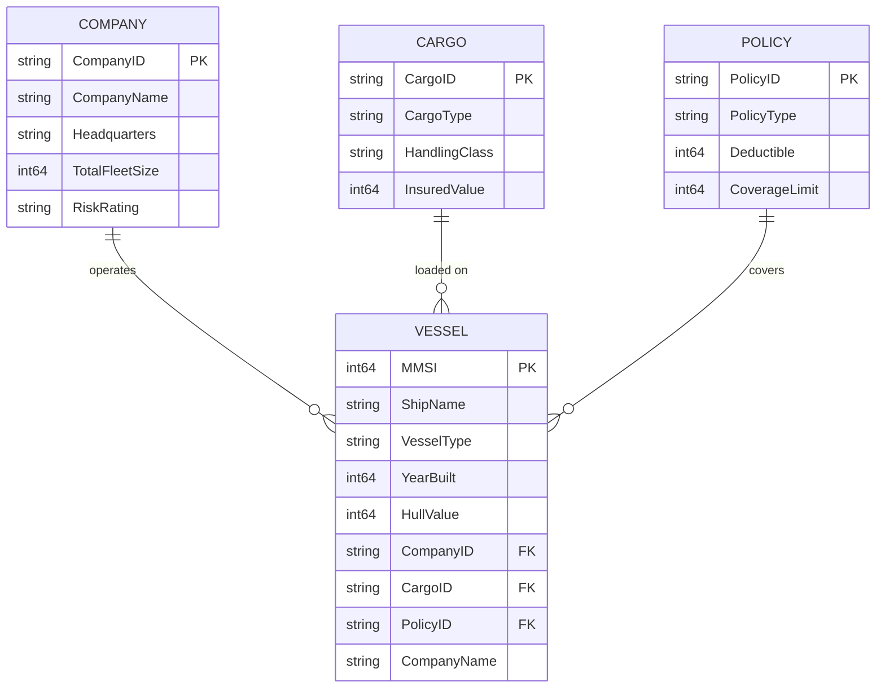

# 🚢 Maritime Risk Assessment Data Agent ("Company Brain")

This repository provides the architectural blueprint for a maritime insurance "Company Brain." By fusing real-time IoT vessel telemetry with unstructured policy documentation, this solution enables generative AI to execute dynamic, ontology-driven risk and compliance checks.

## 🏗 High-Level Architecture

The solution relies on four core layers integrated within **Microsoft Fabric**:

1. **Ontology Layer:** Defines the semantic relationship between vessels, companies, cargo, and insurance contracts.
2. **Telemetry Stream:** We leverage **[AisStream.io](https://aisstream.io/)** as our real-time global maritime data source. Live AIS telemetry is ingested via Fabric Eventstream into a KQL Database (Eventhouse).
3. **Policy Knowledge Base:** Vectorized insurance policy documentation indexed in **Azure AI Search** for RAG (Retrieval-Augmented Generation).
4. **Data Agent:** An orchestrator that dynamically computes risk by mapping live vessel coordinates (from Eventhouse) against contractual warranties (from Azure AI Search).

## 🌳 Ontology & Entity Relations

The business ontology is materialized in the **`maritimeSM`** semantic model (Direct Lake over `maritimeLH`). The **Vessel** is the central entity that ties together the operating **Company**, the carried **Cargo**, and the covering **Policy**.

### Entity Tree

```text
Vessel (hub entity)
├── operated by ──▶ Company   (CompanyID)
├── carries ──────▶ Cargo     (CargoID)
└── insured by ───▶ Policy    (PolicyID)
```

### Entity-Relationship Diagram



### Relationships

| From (Vessel) | To Entity | Key | Cardinality | Meaning |
| ------------- | --------- | --- | ----------- | ------- |
| `vessels.CompanyID` | `companies.CompanyID` | CompanyID | Company 1 — ∗ Vessel | The company that operates the vessel |
| `vessels.CargoID` | `cargomaster.CargoID` | CargoID | Cargo 1 — ∗ Vessel | The cargo currently loaded on the vessel |
| `vessels.PolicyID` | `policies.PolicyID` | PolicyID | Policy 1 — ∗ Vessel | The insurance policy covering the vessel |

All three relationships use **bi-directional cross-filtering**, allowing the Data Agent to traverse the ontology in either direction — e.g., from a high-risk zone infraction on a live vessel back to its `RiskRating` (Company), `HandlingClass` (Cargo), and `CoverageLimit` / `Deductible` (Policy).

## 📁 Repository Structure

```text
├── fabric-assets/      # Schema definitions for Eventhouse and Eventstream
├── notebooks/          # Fabric Notebooks for initialization and simulation
│   ├── createOntology.ipynb            # Builds static metadata (Vessels, Companies, Policies)
│   ├── runVessels.ipynb                # Live telemetry generator streaming to Eventhouse
│   ├── runVesselswithSimulation.ipynb  # Simulated ship #1 itinerary crossing risk zones
│   └── runVesselswithSimulation2.ipynb # Simulated ship #2 itinerary crossing risk zones
├── resources/           # Policy documents (Source of Truth for RAG)
└── maps/               # Power BI/Real-Time Dashboard definitions

```

## 🚀 Deployment Instructions

### 1. Initialize the Ontology

Import the `createOntology.ipynb` notebook into your Fabric Workspace and run it. This establishes your Lakehouse master tables and defines the business ontology.

### 2. Configure Security (Azure Key Vault)

To maintain enterprise security, this solution utilizes **Azure Key Vault**:

1. Create a Key Vault and add secrets: `AisStreamApiKey` and `FabricConnectionString`.
2. Ensure your Fabric identity has **"Key Vault Secrets User"** access to the Key Vault.
3. The `runVessels.ipynb` notebook dynamically fetches these secrets at runtime using `mssparkutils`, ensuring no credentials are ever committed to source control.

### 3. Run Simulations

To fully power the "Company Brain," run the following notebooks:

* **`createOntology.ipynb`**: Required first to populate the static metadata and master data tables.
* **`runVessels.ipynb`**: Creates **real data points** from the live AIS stream — run this continuously to generate and stream real-time telemetry from **[AisStream.io](https://aisstream.io/)** into your Eventhouse.
* **`runVesselswithSimulation.ipynb`** and **`runVesselswithSimulation2.ipynb`**: Create **two simulated ship itineraries** that deliberately cross the defined risk zones. Once running, open the visual map and ask the **Data Agent** questions about policy coverage, total risk assessment, etc. As each ship enters or exits a risk zone, you will see the agent return **different, context-aware responses** — elevated risk and warranty-breach warnings while inside a risk zone, versus standard coverage responses when outside.

### 4. Vectorize & Index Policies

To enable the Data Agent to understand contractual warranties:

1. **Manage Policies:** The policy documents are version-controlled in the `/resources` folder of this repository.
2. **Upload to Lakehouse:** Upload these files from your local clone to your Lakehouse `Files/` directory so they are accessible to the Azure AI Search indexer.
3. **Index:** Configure an Azure AI Search indexer to vectorize these documents (e.g., using `text-embedding-3-large`).

### 5. Visualize Risks

Connect your Power BI reports/dashboards to the Eventhouse KQL endpoint to visualize live ship movements, high-risk zone infractions, and policy warranty breaches.

## 🛠 Prerequisites

* A **Microsoft Fabric** capacity (Trial or Premium).
* **Azure Key Vault** for secure credential management.
* **Azure AI Search** for policy vectorization.

## 👨‍💻 Author

**Dori Rabin** Cloud Solution Architect

