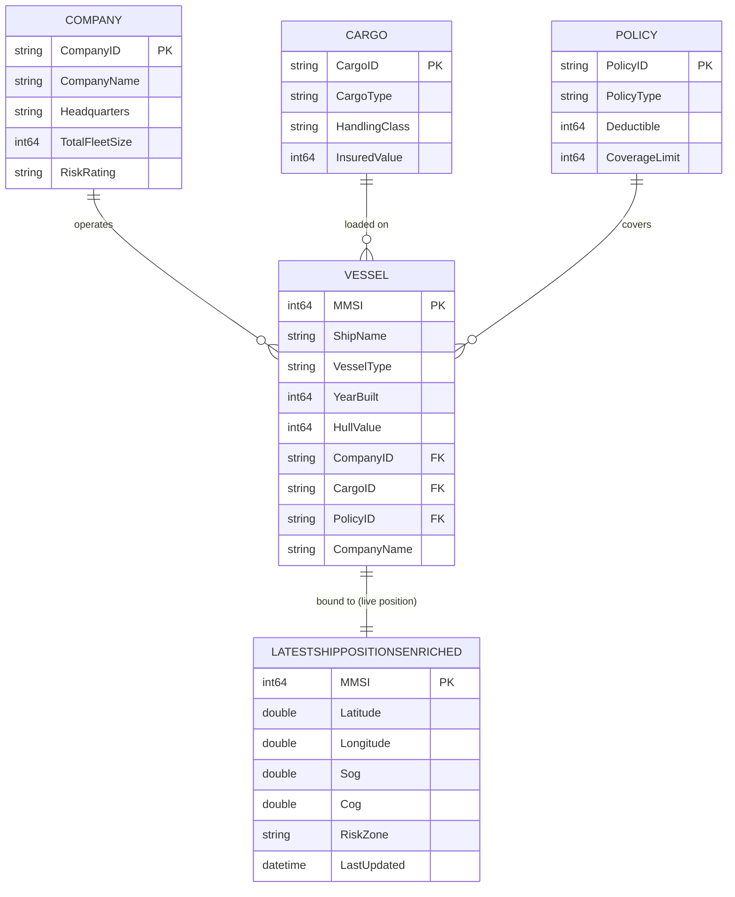

# 🚢 Maritime Risk Assessment Data Agent ("Company Brain")

This repository provides the architectural blueprint for a maritime insurance "Company Brain." By fusing real-time IoT vessel telemetry with unstructured policy documentation, this solution enables generative AI to execute dynamic, ontology-driven risk and compliance checks.

## 🏗 High-Level Architecture


The solution relies on four core layers integrated within **Microsoft Fabric**:

1. **Ontology Layer:** Defines the semantic relationship between vessels, companies, cargo, and insurance contracts.
2. **Telemetry Stream:** We leverage **[AisStream.io](https://aisstream.io/)** as our real-time global maritime data source. Live AIS telemetry is ingested via Fabric Eventstream into a KQL Database (Eventhouse).
3. **Policy Knowledge Base:** Vectorized insurance policy documentation indexed in **Azure AI Search** for RAG (Retrieval-Augmented Generation).
4. **Data Agent:** An orchestrator that dynamically computes risk by mapping live vessel coordinates (from Eventhouse) against contractual warranties (from Azure AI Search).

## 🌳 Ontology & Entity Relations

The business ontology is materialized in the **`maritimeSM`** semantic model (Direct Lake over `maritimeLH`). The **Vessel** is the central entity that ties together the operating **Company**, the carried **Cargo**, and the covering **Policy**.

### Entity Tree

```text
Vessel (hub entity)
├── operated by ──▶ Company   (CompanyID)
├── carries ──────▶ Cargo     (CargoID)
├── insured by ───▶ Policy    (PolicyID)
└── located at ───▶ LatestShipPositionsEnriched  (Eventhouse MV — live position, keyed by MMSI)
```

### Live Position Binding

The **Vessel** entity is bound to the Eventhouse **materialized view** `LatestShipPositionsEnriched`. A materialized view in KQL de-duplicates the incoming AIS stream and keeps only the **most recent record per distinct ship (MMSI)** — so at any point in time the ontology resolves each vessel to its **current, real-time location** (plus enriched attributes such as speed, heading, and the risk zone it currently occupies). This is what lets the Data Agent evaluate risk against a vessel's *live* position rather than a stale snapshot.

### Entity-Relationship Diagram



> **`LATESTSHIPPOSITIONSENRICHED`** is the Eventhouse materialized view (not a Lakehouse table). It is keyed 1:1 to `VESSEL` on `MMSI` and always exposes the single latest enriched position row per distinct ship.

### Relationships

| From (Vessel) | To Entity | Key | Cardinality | Meaning |
| ------------- | --------- | --- | ----------- | ------- |
| `vessels.CompanyID` | `companies.CompanyID` | CompanyID | Company 1 — ∗ Vessel | The company that operates the vessel |
| `vessels.CargoID` | `cargomaster.CargoID` | CargoID | Cargo 1 — ∗ Vessel | The cargo currently loaded on the vessel |
| `vessels.PolicyID` | `policies.PolicyID` | PolicyID | Policy 1 — ∗ Vessel | The insurance policy covering the vessel |

All three relationships use **bi-directional cross-filtering**, allowing the Data Agent to traverse the ontology in either direction — e.g., from a high-risk zone infraction on a live vessel back to its `RiskRating` (Company), `HandlingClass` (Cargo), and `CoverageLimit` / `Deductible` (Policy).

## 📁 Repository Structure

```text
├── fabric-assets/      # Schema definitions for Eventhouse and Eventstream
├── notebooks/          # Fabric Notebooks for initialization and simulation
│   ├── runVessels.ipynb                # Live telemetry generator streaming to Eventhouse (run first)
│   ├── runVesselswithSimulation.ipynb  # Simulated ship #1 itinerary crossing risk zones
│   ├── runVesselswithSimulation2.ipynb # Simulated ship #2 itinerary crossing risk zones
│   └── createOntology.ipynb            # Builds entity tables from Eventhouse ship data (run after)
├── resources/           # Policy documents (Source of Truth for RAG)
└── maps/               # Power BI/Real-Time Dashboard definitions

```

## 🚀 Deployment Instructions

> **Order matters.** The ontology creation notebook builds the Lakehouse entity tables **from the ship data already landed in the Eventhouse**. You must therefore populate the Eventhouse with real + simulated ship data **first** (Step 2), and only then build the ontology (Step 3).

### 1. Configure Security (Azure Key Vault)

To maintain enterprise security, this solution utilizes **Azure Key Vault**:

1. Create a Key Vault and add the secrets listed in [🔑 Secret Keys](#-secret-keys) below.
2. Ensure your Fabric identity has **"Key Vault Secrets User"** access to the Key Vault.
3. The `runVessels.ipynb` notebook dynamically fetches these secrets at runtime using `mssparkutils`, ensuring no credentials are ever committed to source control.

#### 🔑 Secret Keys

Store the following secrets in your Key Vault — **never** hard-code them in notebooks or commit them to source control:

| Secret name | Description | How to obtain |
| ----------- | ----------- | ------------- |
| `AisStreamApiKey` | API key used to authenticate to the **AisStream.io** real-time AIS WebSocket feed consumed by `runVessels.ipynb`. | **Must be generated** — see below. |
| `FabricConnectionString` | Connection string used to write telemetry into your Fabric Eventhouse / Lakehouse. | From your Fabric workspace item settings. |

**Generating the AisStream.io API key**

The `AisStreamApiKey` is not provided with this repo — you must generate your own:

1. Create a free account at **[AisStream.io](https://aisstream.io/)**.
2. Generate an API key from your account dashboard.
3. Follow the official authentication guide: **<https://aisstream.io/documentation#Authentication>**.
4. Add the generated key to Key Vault as the secret named `AisStreamApiKey`.

> The AisStream.io WebSocket API requires this key to be sent in the subscription message on connect. Without a valid key the live telemetry stream in `runVessels.ipynb` will fail to authenticate. See the [Authentication docs](https://aisstream.io/documentation#Authentication) for the exact message format.

### 2. Run the Vessel & Simulation Notebooks (populate the Eventhouse)

Run these notebooks **first** — they land the real and simulated ship telemetry into the Eventhouse tables that everything else depends on:

* **`runVessels.ipynb`**: Creates **real data points** from the live AIS stream — run this to generate and stream real-time telemetry from **[AisStream.io](https://aisstream.io/)** into your Eventhouse.
* **`runVesselswithSimulation.ipynb`** and **`runVesselswithSimulation2.ipynb`**: Create **two simulated ship itineraries** that deliberately cross the defined risk zones, also streaming into the Eventhouse.

Together these populate the Eventhouse tables (including the `LatestShipPositionsEnriched` materialized view) with the distinct ships — real and simulated — that the ontology is built from.

### 3. Initialize the Ontology

Import the `createOntology.ipynb` notebook into your Fabric Workspace and run it. It reads the ship data landed in the Eventhouse (Step 2) to populate the **base master/entity tables inside the Lakehouse** (Vessels, Companies, Cargo, Policies). These base tables are the foundation for the rest of the solution:

* **Semantic model** — the `maritimeSM` Direct Lake semantic model is built on top of these Lakehouse tables.
* **Report** — the Power BI report (`Vessels By Company`) is built on top of that semantic model.
* **Ontology (first version)** — the **first version of the ontology component** is generated **manually from the semantic model** (using the *Create ontology* button inside `maritimeSM`), not by the notebook. This initial ontology captures the static business entities and relationships **before** the real-time position data from the Eventhouse (the `LatestShipPositionsEnriched` materialized view) is bound to the `Vessel` entity.

**Run this only after Step 2 has populated the Eventhouse**, otherwise the base tables — and everything built on them — will be empty.

### 4. Vectorize & Index Policies

> ⚠️ **Build the Azure AI Search index before you start asking the Data Agent questions** — the agent needs the policy index in place to answer contractual/warranty questions once the simulated ships are crossing the risk zones.

To enable the Data Agent to understand contractual warranties:

1. **Manage Policies:** The policy documents are version-controlled in the `/resources` folder of this repository.
2. **Upload to Lakehouse:** Upload these files from your local clone to your Lakehouse `Files/` directory so they are accessible to the Azure AI Search indexer.
3. **Index:** Configure an Azure AI Search indexer to vectorize these documents (e.g., using `text-embedding-3-large`).

### 5. Explore & Visualize Risks

Open the visual map and ask the **Data Agent** questions about policy coverage, total risk assessment, etc. As each ship enters or exits a risk zone, you will see the agent return **different, context-aware responses** — elevated risk and warranty-breach warnings while inside a risk zone, versus standard coverage responses when outside. Connect your Power BI reports/dashboards to the Eventhouse KQL endpoint to visualize live ship movements, high-risk zone infractions, and policy warranty breaches.

## 🤖 Building the Data Agent

The **Maritime Data Agent** ("Company Brain") is the orchestration layer that fuses live telemetry, the business ontology, and unstructured policy text into a single natural-language interface. It is defined in **`maritimeDA.DataAgent`**.

### Data Sources

The agent is grounded on **three** complementary sources — each answering a different part of a risk question:

| # | Source | Type | Role in the Agent |
| - | ------ | ---- | ----------------- |
| 1 | **`LatestShipPositionsEnriched`** | Eventhouse materialized view (KQL) | The *live position* source — supplies each ship's current location, speed, heading, and the risk zone it currently occupies (latest row per distinct `MMSI`). |
| 2 | **`maritimeSM` ontology** | Direct Lake semantic model | The *business context* — resolves a vessel to its operating **Company**, carried **Cargo**, and covering **Policy** (with `RiskRating`, `HullValue`, `CoverageLimit`, `Deductible`, etc.). |
| 3 | **Azure AI Search policy index** | Vector index (RAG) | The *contractual truth* — retrieves the exact warranty / exclusion clauses from the vectorized policy documents in `/resources`. |

At query time the agent maps a vessel's live coordinates (source 1) onto its contractual context (source 2), then retrieves and cites the relevant policy clauses (source 3) to produce a grounded risk & compliance answer.

### Agent Instructions (System Prompt)

The agent is configured with instructions along these lines:

```text
You are the Maritime Risk Assessment "Company Brain."
Answer questions about vessels, their operators, cargo, insurance policies, and
real-time risk exposure.

Grounding rules:
- Always resolve a ship's CURRENT location from LatestShipPositionsEnriched
  (the Eventhouse materialized view — one latest row per MMSI). Never use stale rows.
- Use the ontology (Vessel → Company / Cargo / Policy) to enrich the ship with its
  business and contractual context.
- For any policy, warranty, coverage-limit, deductible, or exclusion question,
  retrieve and CITE the relevant clause from the Azure AI Search policy index.
- A vessel is "in a risk zone" only when its latest RiskZone value is a named zone
  (not null/none). Base risk statements on that live value.

Behavior:
- If a ship is inside a risk zone, flag elevated risk and call out any breached
  warranties, plus the financial exposure (HullValue, CoverageLimit, Deductible).
- If a ship is outside all risk zones, report standard coverage with no active breach.
- Always state whether your answer is based on live position, ontology, or policy text.
- Be concise, quantify exposure where possible, and never invent policy terms.
```

### Few-Shot Prompts

These example prompts demonstrate the different, context-aware answers the agent returns depending on whether a ship is inside or outside a risk zone:

| Prompt | Expected behavior |
| ------ | ----------------- |
| *"Where is vessel <ShipName> right now and is it in a risk zone?"* | Reads latest row from `LatestShipPositionsEnriched`; reports live lat/long + current `RiskZone`. |
| *"What is the total risk assessment for <ShipName>?"* | Joins live position → ontology (Company `RiskRating`, `HullValue`) → policy `CoverageLimit`/`Deductible`; summarizes total exposure. |
| *"Is <ShipName> in breach of any policy warranty?"* | If inside a risk zone, retrieves the matching warranty/exclusion clause from AI Search and flags the breach; if outside, reports no active breach. |
| *"Which of my ships are currently inside a high-risk zone?"* | Filters `LatestShipPositionsEnriched` where `RiskZone` is a named zone; lists the affected vessels and their operators. |
| *"What does the policy say about war-risk zones for <ShipName>?"* | Pure RAG call to the Azure AI Search policy index; quotes and cites the relevant clause. |

> 💡 Try the same prompt twice — once while a simulated ship is **inside** a risk zone and once while it is **outside** — to see the agent's grounded response change in real time.

## 🛠 Prerequisites

* A **Microsoft Fabric** capacity (Trial or Premium).
* **Azure Key Vault** for secure credential management.
* **Azure AI Search** for policy vectorization.
* An **[AisStream.io](https://aisstream.io/)** account with a generated **API key** — see [🔑 Secret Keys](#-secret-keys) and the [Authentication docs](https://aisstream.io/documentation#Authentication).

## 👨‍💻 Author

**Dori Rabin** Cloud Solution Architect

