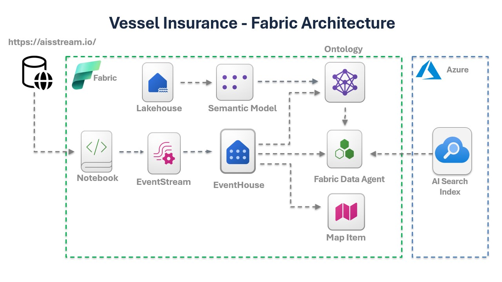
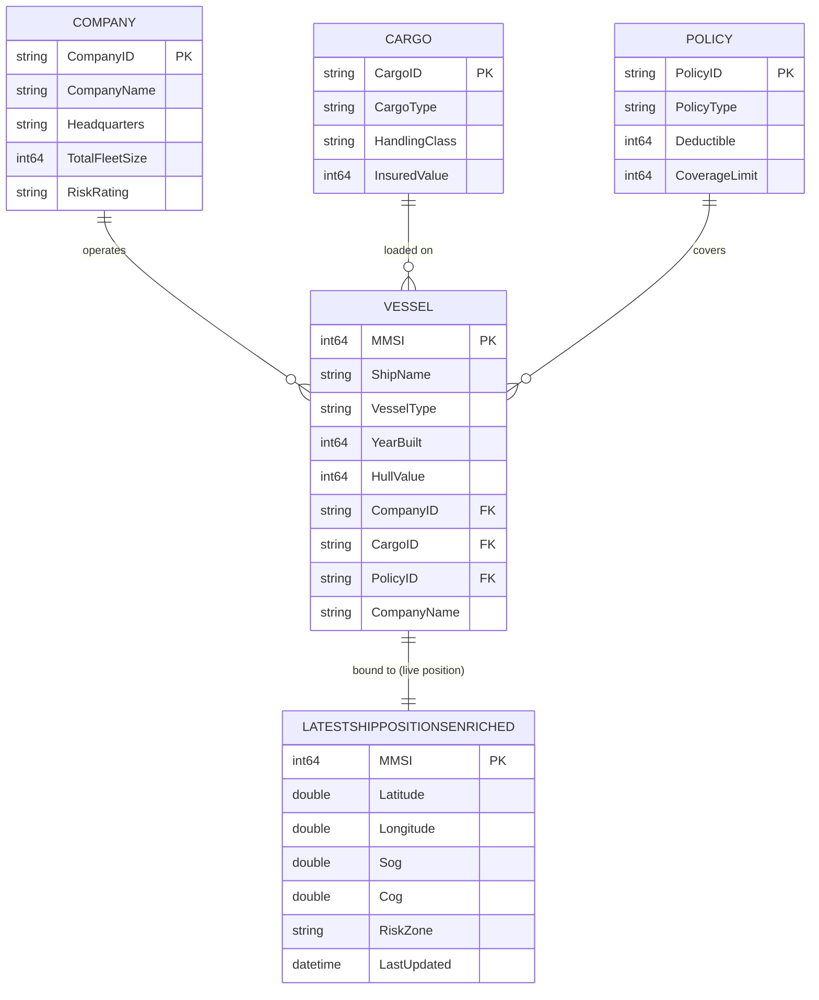

# 🚢 Maritime Risk Assessment Data Agent ("Company Brain")

A maritime insurance "Company Brain" that fuses real-time vessel telemetry with policy documentation to enable AI-driven risk and compliance checks.

## 🏗 High-Level Architecture



Four core layers in **Microsoft Fabric**:

1. **Ontology Layer:** Semantic relationships between vessels, companies, cargo, and insurance contracts
2. **Telemetry Stream:** Real-time AIS data from **[AisStream.io](https://aisstream.io/)** → Eventstream → Eventhouse
3. **Policy Knowledge Base:** Insurance documents indexed in **Azure AI Search** for RAG
4. **Data Agent:** Maps live vessel positions to policy warranties for risk assessment

## 🌳 Ontology & Entity Relations

The **Vessel** entity connects **Company**, **Cargo**, and **Policy** in the `maritimeSM` semantic model (DirectLake over `maritimeLH` lakehouse).

### Entity Tree

```text
Vessel (hub entity)
├── operated by ──▶ Company   (CompanyID)
├── carries ──────▶ Cargo     (CargoID)
├── insured by ───▶ Policy    (PolicyID)
└── located at ───▶ LatestShipPositionsEnriched  (Eventhouse MV — live position, keyed by MMSI)
```

### Live Position Binding

Vessels bind to the Eventhouse materialized view `LatestShipPositionsEnriched`, which keeps the latest record per ship (MMSI). This provides real-time location, speed, heading, and current risk zone for dynamic risk assessment.

### Entity-Relationship Diagram



> **`LATESTSHIPPOSITIONSENRICHED`** is the Eventhouse materialized view (not a Lakehouse table). It is keyed 1:1 to `VESSEL` on `MMSI` and always exposes the single latest enriched position row per distinct ship.

### Relationships

| From (Vessel) | To Entity | Key | Cardinality | Meaning |
| ------------- | --------- | --- | ----------- | ------- |
| `vessels.CompanyID` | `companies.CompanyID` | CompanyID | Company 1 — ∗ Vessel | The company that operates the vessel |
| `vessels.CargoID` | `cargomaster.CargoID` | CargoID | Cargo 1 — ∗ Vessel | The cargo currently loaded on the vessel |
| `vessels.PolicyID` | `policies.PolicyID` | PolicyID | Policy 1 — ∗ Vessel | The insurance policy covering the vessel |

All relationships use **bi-directional cross-filtering** for ontology traversal (e.g., vessel → company risk rating, cargo handling class, policy coverage).

## 📁 Repository Structure

```text
├── fabric-assets/      # Schema definitions for Eventhouse and Eventstream
├── notebooks/          # Fabric Notebooks for initialization and simulation
│   ├── runVessels.ipynb                # Live telemetry generator streaming to Eventhouse (run first)
│   ├── runVesselswithSimulation.ipynb  # Simulated ship #1 itinerary crossing risk zones
│   ├── runVesselswithSimulation2.ipynb # Simulated ship #2 itinerary crossing risk zones
│   └── createOntology.ipynb            # Builds entity tables from Eventhouse ship data (run after)
├── resources/           # Policy documents (Source of Truth for RAG)
└── maps/               # Power BI/Real-Time Dashboard definitions

```

## 🚀 Deployment Instructions

### Quick Start

**For most users**: Clone this repository and run `deployworkspace.ipynb` to deploy all 18 Fabric items in ~3 minutes with automatic dependency management.

```bash
git clone -b fabriciq-maritimedemo https://github.com/dorirabin/fabricdemo.git
cd fabricdemo
pip install azure-identity fabric-cicd requests
code deployworkspace.ipynb  # Open in VS Code and run cells 1-9
```

After deployment, follow the post-deployment configuration steps to initialize the ontology and configure the vessel notebooks.

---

### Deployment from Git

This repository includes an automated deployment notebook that deploys all 18 Fabric items with proper dependency management in a single execution.

#### Prerequisites

1. **Python Environment**:
   ```bash
   pip install azure-identity fabric-cicd requests
   ```

2. **Git Clone**:
   ```bash
   git clone -b fabriciq-maritimedemo https://github.com/dorirabin/fabricdemo.git
   cd fabricdemo
   ```

3. **Microsoft Fabric Workspace**: Create an empty Fabric workspace or use an existing one

#### Deployment Steps

1. **Open the deployment notebook** in VS Code or Jupyter:
   ```bash
   code deployworkspace.ipynb
   ```

2. **Authenticate**: Run cells 1-5 to authenticate with Azure and select your target workspace
   - The notebook uses `DeviceCodeCredential` for browser-based authentication
   - You'll be prompted to select your target workspace from the list

3. **Deploy all items**: Run cell 9 to execute the complete 6-phase deployment:
   - **Phase 1**: Lakehouse + Eventhouse (data foundation)
     - Automatically uploads GeoJSON files to Lakehouse Files
   - **Phase 2**: SemanticModel + Power BI Report
     - Automatically updates DirectLake connection to new Lakehouse
   - **Phase 3**: Ontology
     - Automatically links to deployed Power BI report
   - **Phase 4**: Notebooks + Eventstream + Data Agent
   - **Phase 5**: Reflex (alert/activator)
   - **Phase 6**: Map (depends on Ontology)

4. **Verify deployment**: The notebook automatically verifies all 18 items are deployed correctly

5. **Next steps**: After deployment completes, proceed to [Initialize Ontology Tables](#initialize-ontology-tables) below

#### What Gets Deployed

The automated deployment creates:
- **1 Lakehouse** (`maritimeLH`) with 2 GeoJSON files
- **1 Eventhouse** (`maritimeEH`) with KQL Database
- **1 SemanticModel** (`maritimeSM`) with DirectLake connection
- **1 Power BI Report** (`Vessels By Company`)
- **1 Ontology** (`maritimeOntologyfromSM`) linked to the report
- **4 Notebooks** (createOntology, runVessels, runVesselswithSimulation, runVesselswithSimulation2)
- **1 Eventstream** (`maritimeES`)
- **1 Data Agent** (`maritimeDA`)
- **1 Reflex** (`RedAlertActivator`)
- **1 Map** (`vessels_map`)

> 💡 **Important**: The deployment notebook handles all dependencies automatically - workspace references, lakehouse IDs, and resource links are dynamically updated during deployment.

---

## Post-Deployment Configuration

After deploying the Fabric items, follow these steps to populate data and initialize the ontology:

### 1. Configure Vessel Notebooks

The three `runVessels` notebooks require 3 parameters that must be configured before running:

#### 📋 Required Parameters

| Parameter | Description | How to obtain |
| --------- | ----------- | ------------- |
| **`AISSTREAM_API_KEY`** | API key for AisStream.io real-time AIS data | See [Get AisStream API Key](#get-aisstream-api-key) below |
| **`FABRIC_ENTITY_NAME`** | Event Hub name from Eventstream endpoint | See [Get Eventstream Connection Details](#get-eventstream-connection-details) below |
| **`FABRIC_CONNECTION_STR`** | Event Hub connection string from Eventstream | See [Get Eventstream Connection Details](#get-eventstream-connection-details) below |

#### Get AisStream API Key

1. **Create a free account** at [AisStream.io](https://aisstream.io/)
2. **Navigate to your dashboard** after logging in
3. **Generate an API key** (usually under "API Keys" or "Account Settings")
4. **Copy the generated key** - you'll use this for `AISSTREAM_API_KEY`

> 📖 **Authentication docs**: <https://aisstream.io/documentation#Authentication>

#### Get Eventstream Connection Details

After deploying the Eventstream, retrieve the Event Hub name and connection string:

1. **Open Fabric portal**: https://app.fabric.microsoft.com
2. **Navigate to your deployed workspace**
3. **Open the `maritimeES` Eventstream**
4. **Click on `LiveAISSource`** (Custom Endpoint in the diagram)
5. **Go to `SAS Key Authentication` tab → `Live view`**
6. **Copy both values**:
   - **Event Hub name** (e.g., `esehchxkj881x95xl1hgnk_eh`) → use for `FABRIC_ENTITY_NAME`
   - **Connection string** (starts with `Endpoint=sb://...`) → use for `FABRIC_CONNECTION_STR`

#### Update Notebook Configuration Cells in Fabric Workspace

**Open each notebook in the Fabric portal** and update the **first configuration cell**:

**Notebooks to configure in Fabric:**
- `runVessels`
- `runVesselswithSimulation`
- `runVesselswithSimulation2`

**Configuration cell (first code cell in each notebook):**

```python
# ===== CONFIGURATION =====

# 1. AisStream.io API Key
AISSTREAM_API_KEY = "your-key-from-aisstream-dashboard"  # ← UPDATE THIS

# 2. Eventstream Event Hub Name (from Step 2 above)
FABRIC_ENTITY_NAME = "esehchxkj881x95xl1hgnk_eh"  # ← UPDATE THIS

# 3. Eventstream Connection String (from Step 2 above)
# Option A (Production): Use Azure Key Vault
KEY_VAULT_NAME = "https://kv-maritime-demo.vault.azure.net/"  # ← UPDATE THIS
FABRIC_CONNECTION_STR = mssparkutils.credentials.getSecret(KEY_VAULT_NAME, "FabricConnectionString")

# Option B (Local Testing): Use direct value (NEVER commit to Git!)
# FABRIC_CONNECTION_STR = "Endpoint=sb://xxxxx.servicebus.windows.net/;SharedAccessKeyName=...;SharedAccessKey=...;EntityPath=esehchxkj881x95xl1hgnk_eh"  # ← UPDATE THIS
```

> 💡 **Best Practice**:  
> - **Production**: Store `FABRIC_CONNECTION_STR` in Azure Key Vault (Option A)  
> - **Local Testing**: Use direct values (Option B) but **never commit to source control**
> - **Git Repository**: Keep Git files in template state - configuration is workspace-specific

### 2. Run Vessel Notebooks to Populate Eventhouse

Run all three notebooks for **1-2 minutes each** to populate the Eventhouse:

1. **`runVessels`**: Real-time AIS stream from [AisStream.io](https://aisstream.io/)
2. **`runVesselswithSimulation`**: First simulated ship crossing risk zones
3. **`runVesselswithSimulation2`**: Second simulated ship crossing risk zones

> ⚠️ **Limited Capacity?** Run sequentially instead of simultaneously if needed.

> 🗺️ **Preview Data**: Open the `vessels_map` Map after running to visualize ships in real-time.

### 3. Initialize Ontology Tables

Run `createOntology` notebook to create 5 lakehouse tables from Eventhouse data:

1. Open `createOntology` notebook in Fabric portal
2. Run all cells to create: `companies`, `vessels`, `cargo`, `policies`, `maritimezones`
3. Verify tables in `maritimeLH` Lakehouse

> ⚠️ Run only after vessel notebooks have populated Eventhouse

### 4. Refresh the SemanticModel

1. Open `maritimeSM` SemanticModel in Fabric portal
2. Enter **Editing Mode**
3. Click **Refresh** → **"Schema and data"**
4. Wait for completion

> 💡 **Timing**: Lakehouse metadata can take **15-20 minutes** to sync. If you get "tables don't exist" error, wait and **retry multiple times**. This is normal after creating new tables.

### 5. Verify the Report

1. Open `Vessels By Company` report
2. Verify data appears in visuals
3. If errors persist, retry SemanticModel refresh

### 6. Refresh the Ontology Relationship Graph

1. Open `maritimeOntologyfromSM` Ontology → select any entity (e.g., `maritimezones`)
2. Go to **Overview → Relationship Graph**
3. Add dummy property to trigger graph refresh:
   - **Manage property binding** → **Add properties**
   - Name: `dummystring`, Type: `String`
   - Save
4. Return to Relationship Graph and verify relationships are visible

> 💡 This metadata refresh ensures the graph is initialized for the Data Agent.

### 7. Configure Azure AI Search for Policy Documents

> ⚠️ **REQUIRED MANUAL CONFIGURATION**: The automated deployment **removes** any pre-existing Azure AI Search bindings to ensure a clean state. You **must** create an Azure AI Search index and manually connect it to the Data Agent before querying policies.

> ⚠️ **Build the Azure AI Search index before you start asking the Data Agent questions** — the agent needs the policy index in place to answer contractual/warranty questions once the simulated ships are crossing the risk zones.

The Data Agent uses Azure AI Search to perform RAG (Retrieval-Augmented Generation) on insurance policy documents.

**Policy Documents:**
The repository includes two sample insurance policy documents in the `/resources` folder that should be imported into your Azure AI Search index:
- `POL-9901.docx` - Sample maritime insurance policy
- `POL-9902.docx` - Sample maritime insurance policy

**Setup Instructions:**
Follow the official Microsoft documentation for complete setup instructions:
📖 **[Add an Azure AI Search index to a Data Agent](https://learn.microsoft.com/en-us/fabric/data-science/data-agent-ai-search-index)**

This guide covers:
- Creating an Azure AI Search resource
- Creating and populating a search index with the policy documents from `/resources` folder
- **Adding Azure AI Search as a data source** to your `maritimeDA` Data Agent in Fabric portal

> 💡 **Import Policy Documents**: Use the Azure Portal's **Import wizard with Vector Search capability** to index the policy documents. See: [Import and vectorize data using the Azure portal](https://learn.microsoft.com/en-us/azure/search/search-get-started-portal-import-vectors?tabs=storage-access%2Cblob-storage%2Caoai%2Cvectorize-images)

## 🤖 Building the Data Agent

The **Maritime Data Agent** fuses live telemetry, ontology, and policy documents for natural-language risk assessment.

### Data Sources

Three complementary sources:

| # | Source | Type | Role |
| - | ------ | ---- | ---- |
| 1 | **`LatestShipPositionsEnriched`** | Eventhouse view (KQL) | Live position, speed, heading, risk zone per ship (MMSI) |
| 2 | **`maritimeOntologyfromSM`** | Ontology | Business context: Vessel → Company/Cargo/Policy relationships |
| 3 | **Azure AI Search** | Vector index (RAG) | Policy clauses, warranties, exclusions from `/resources` documents |

> ⚠️ **Important**: After completing the [Post-Deployment Configuration](#post-deployment-configuration), you must **add Azure AI Search as a data source** to the `maritimeDA` Data Agent in Fabric portal. See [Step 7: Configure Azure AI Search](#7-configure-azure-ai-search-for-policy-documents) for detailed instructions.

### Testing the Data Agent

Test multi-source reasoning with simulated vessels:

1. Run `runVesselswithSimulation` and/or `runVesselswithSimulation2`
2. Open Data Agent and Map (`vessels_map`) in Fabric portal  
3. Ask test prompt: **"SIMULATED_TANKER_01 reported a damage are we covering it?"**

The agent queries:
- **Eventhouse**: Current location and risk zone status
- **Ontology**: Vessel relationships (company/cargo/policy)
- **Azure AI Search**: Policy clauses on damage coverage

Then synthesizes conclusion based on risk zone status, coverage limits, and policy terms.

> 💡 Try follow-up questions like "What is the deductible?" or "Which risk zone is it in right now?"

## Explore & Visualize Risks

- **Visual Map**: Open `vessels_map` for live ship movements and risk zones
- **Data Agent**: Ask about policy coverage, risk assessment, warranty compliance
- **Context-Aware Responses**: Answers change based on ship location (inside/outside risk zones)
- **Power BI Dashboards**: Connect to Eventhouse KQL endpoint for visualizations

## 🛠 Prerequisites

* A **Microsoft Fabric** capacity (Trial or Premium).
* **Azure AI Search** for policy vectorization.
* An **[AisStream.io](https://aisstream.io/)** account with a generated **API key** — see [🔑 Secret Keys](#-secret-keys) and the [Authentication docs](https://aisstream.io/documentation#Authentication).

**Optional:**
* **Azure Key Vault** (recommended for production; optional for local testing - see [Configure Security](#1-configure-security-and-api-keys)).

## 👨‍💻 Author

**Dori Rabin** Cloud Solution Architect

## 🙏 Thanks

**Reviewers and Contributors:**
- Dori Rabin (rabindori@microsoft.com)
- Uri Gaziel (urigaziel@microsoft.com)
- Yonathan Morgan (ymorgan@microsoft.com)

